# Strategic Customer Behavioral Segmentation & Retail Intelligence
## Project Overview
This repository documents a comprehensive investigation into retail customer behavior using unsupervised machine learning. By analyzing a primary dataset of 200 mall visitors, I architected a K-Means Clustering pipeline that progresses from foundational data exploration to an advanced multivariate model. The objective was to move beyond traditional demographic sorting (such as Age or Gender) to uncover high-velocity spending segments and optimize marketing resource allocation.
The core of this project demonstrates high-level proficiency in exploratory data analysis, feature engineering, feature scaling, and unsupervised model optimization.
## Business Problem & Objectives
Generic marketing outreach often suffers from low return on investment (ROI) because it fails to account for the "Efficiency Gap" between customer income and actual spending. This project solves that by answering four strategic questions:
1. Which segments represent the highest "Spend-to-Income" efficiency?
2. How do Age and Gender truly influence spending velocity versus raw salary capacity?
3. Where are the "Revenue Leaks" (high-income individuals with zero engagement) located within the current customer base?
4. What is the definitive Priority Target for immediate, phase-one campaign deployment?
## Dataset Description
The analysis is grounded in a customer dataset structured for behavioral profiling:
- **CustomerID**: Unique identifier for tracking.
- **Gender & Age**: Primary demographic variables.
- **Annual Income (k$)**: The financial "Capacity" metric.
- **Spending Score (1-100)**: The primary "Behavioral" metric assigned by the mall based on historical customer data.
## Project Structure
The workspace is organized to ensure reproducibility, separating raw data processing from strategic deliverables and visual assets.
```plaintext
├── customer_segmentation_analysis.ipynb       # Main Python analytical workspace
├── visualization/                             # High-resolution analytical assets
│   ├── boxplot_gender_age.png                 
│   ├── boxplot_gender_income.png              
│   ├── boxplot_gender_spending_score.png      
│   ├── count_age.png                          
│   ├── count_annual_income.png                
│   ├── count_spending_score.png               
│   ├── gender_age_density.png                 
│   ├── gender_income_density.png              
│   ├── gender_spending_score_density.png      
│   ├── heatmap_corr_matrix.png                
│   ├── kmeans1_elbow.png                      
│   ├── kmeans2_elbow.png                      
│   ├── kmeans3_elbow.png                      
│   ├── pairplot_across.png                    
│   ├── splot_cx_segments.png                  
│   └── splot_income_spending.png              
├── Deliverables/
│   ├── Strategic_Segmentation_Report.md       # Executive growth strategy
│   └── Strategic_Customer_Segmentation_Final.csv # Final labeled dataset
├── .gitignore                                 # System & Cache protection
└── README.md                                  # Technical documentation


```
## Technical Implementation Workflow
The analytical pipeline was designed to systematically build complexity, ensuring every mathematical decision was justified by the data.
### 1. Feature Engineering
Engineered a custom **Spend-to-Income Ratio** to identify "Efficiency Shoppers"—customers who convert the highest percentage of their earnings into mall retail spending.
### 2. Univariate Exploratory Data Analysis (EDA)
Analyzed individual variables using distribution plots and boxplots to understand baseline distributions, data spread, and identify mathematical outliers across demographics.
### 3. Bivariate & Correlation Analysis
Examined relationships between pairs of variables utilizing Pairplots and Correlation Heatmaps. A bivariate scatter plot mapping Annual Income against Spending Score revealed initial visual clustering, suggesting that combining dimensions yields clearer market partitions than univariate sorting.
### 4. Univariate & Bivariate Clustering (The Baseline)
To build a mathematically sound foundation, K-Means was initially applied to single and paired variables. The **Elbow Method** was utilized at each step (Income alone, then Income vs. Spend) to track the optimal number of clusters as dimensionality increased.
### 5. Multivariate Analysis & Preprocessing
To ensure the final K-Means algorithm treated variables with different units (Years vs. Dollars) with equal weight, a rigorous preprocessing pipeline was applied:
- **One-Hot Encoding:** Converted categorical `Gender` data into a binary numeric format using `pd.get_dummies`.
- **Standardization:** Applied `StandardScaler` to shift the mean of all features to 0 and the standard deviation to 1, preventing variables with larger raw numbers (Annual Income) from disproportionately influencing the Euclidean distance calculations.
### 6. Executing Final Multivariate Clustering
The final model integrated Age, Encoded Gender, Annual Income, and Spending Score. Based on the multivariate Elbow Analysis, the algorithm was initialized with K=5, establishing the mathematical mandate for our five strategic customer personas.
## Detailed Analysis & Visual Evidence
### Step 1: Univariate EDA & Outlier Detection
Initial exploration focuses on understanding the distribution of our primary metrics and identifying any statistical outliers across genders.

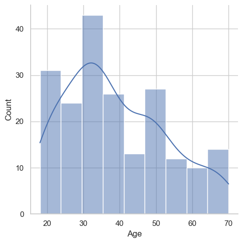

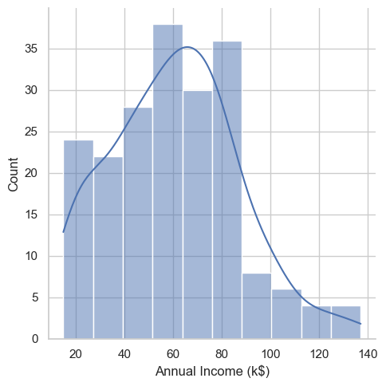

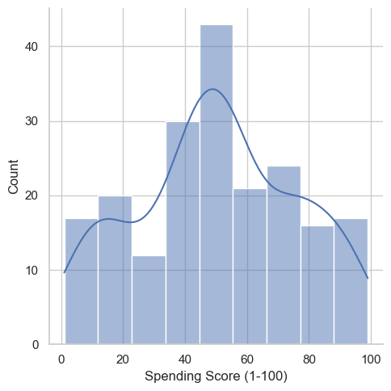
<br>*[Notebook Reference: Generated from the `sns.displot(df[i], kde=True)` loop in the Univariate EDA section]*

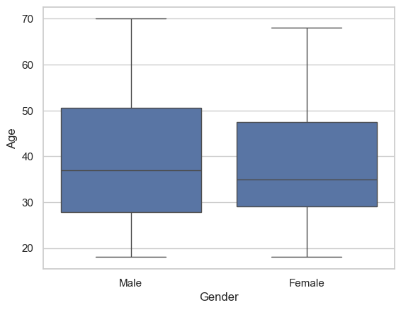

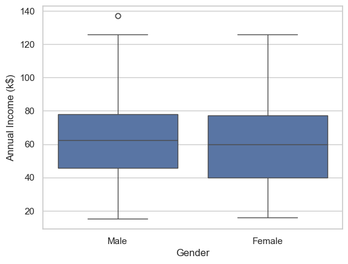

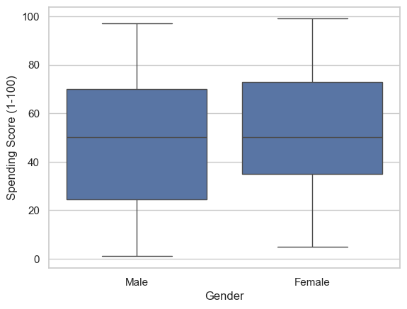
<br>*[Notebook Reference: Generated from the `sns.boxplot(data=df, x='Gender', y=df[i])` loop]*
### Step 2: Demographic Density Analysis (The Demographic Myth)
To prove that broad demographics are insufficient for targeting, we overlay gender on our density plots.

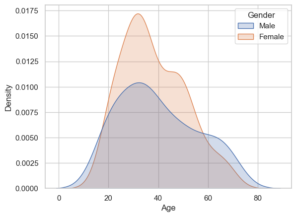

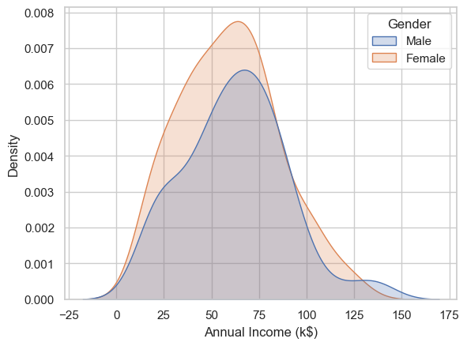

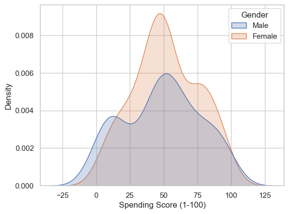
<br>*[Notebook Reference: Generated from the `sns.kdeplot(data=df, x=i, hue='Gender', fill=True, shade=True)` loop]*

**Insights:** While Income and Age are relatively consistent across genders, the Spending Score shows a definitive rightward shift for Female shoppers, indicating higher engagement potential.
### Step 3: Correlation & Bivariate Mapping
We then examine the intersection of metrics to find natural relationships and visual clusters.

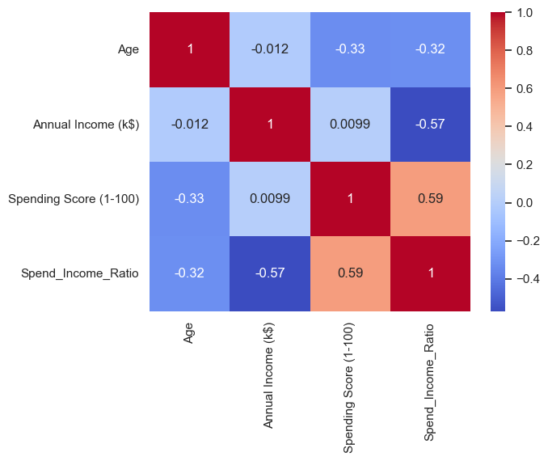
<br>*[Notebook Reference: Generated from the `sns.heatmap` cell]*

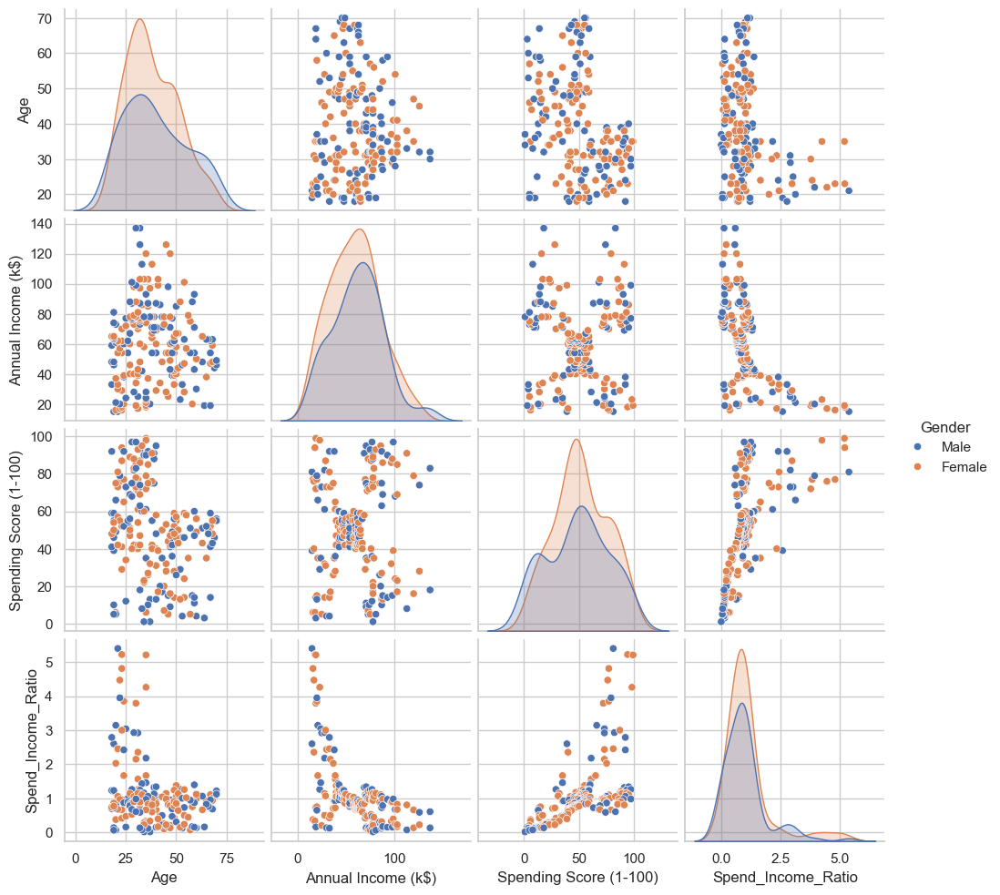
<br>*[Notebook Reference: Generated from the `sns.pairplot(df_pair, hue='Gender')` cell]*

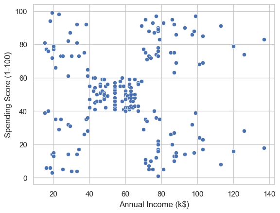
<br>*[Notebook Reference: Generated from the `sns.scatterplot` cell identifying visual clusters]*

**Insights:** The Bivariate scatter clearly shows natural grouping, suggesting the market naturally breaks into distinct quadrants (e.g., High Income/Low Spend vs. High Income/High Spend).
### Step 4: Mathematical Validation (The Elbow Method)
To avoid over-fitting or under-segmenting the market, mathematical optimization (WCSS) was tracked as dimensions were added.

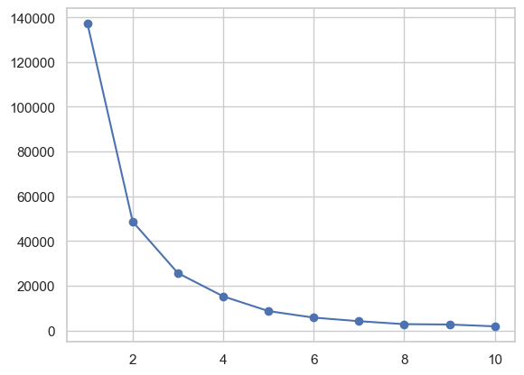
<br>*[Notebook Reference: Generated from the Univariate Income Elbow loop]*

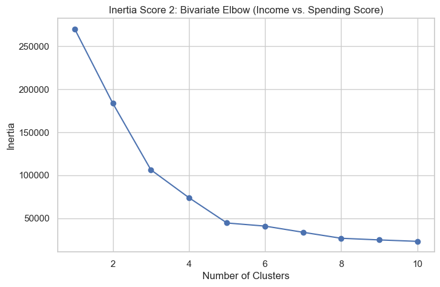
<br>*[Notebook Reference: Generated from the Bivariate Income/Spend Elbow loop]*

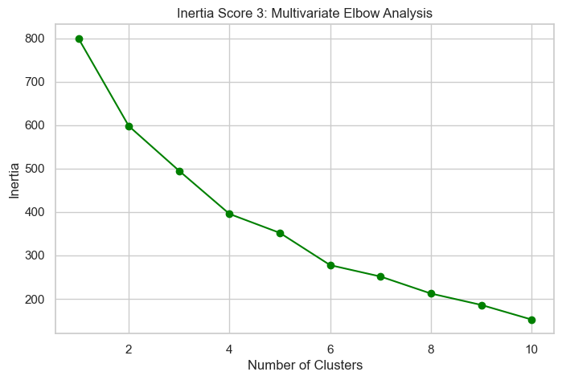
<br>*[Notebook Reference: Generated from the Multivariate Elbow loop `kmeans3.fit(dff_scaled)`]*

**Insights:** The Elbow plots demonstrate how adding dimensions shifts the optimal cluster count. The final multivariate Elbow confirms $K=5$ as the optimal partition.
### Step 5: Final Segment Map
The final step visualizes the resulting personas and their mathematical centers.

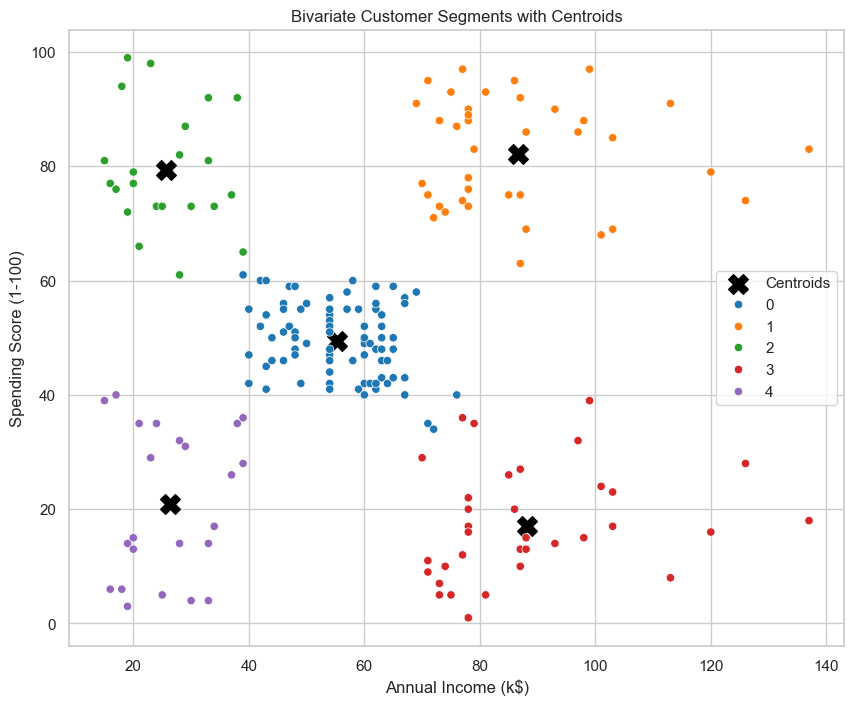
<br>*[Notebook Reference: Generated from the `sns.scatterplot` cell extracting `clustering2.cluster_centers_`]*

**Insights:** The algorithm successfully partitions the market. The "Splurge Shoppers" and "Primary Targets" represent the highest ROI, while the "Untapped Wealth" represents the largest revenue leak.
## Major Discoveries & Strategic Insights
1. **Behavior Outweighs Income:** The most "efficient" shoppers (Cluster 4 - Splurge Shoppers) have moderate incomes ($38.8k) but maintain the highest spend-to-income ratio (1.85).
2. **The "Untapped Wealth" Gap:** High-income individuals ($85.2k) showed the lowest engagement scores (14.1), indicating a critical lack of luxury brand alignment within the mall's current offerings.
3. **Age as a Predictor:** Younger demographics (Avg age 27-28) consistently drive the highest volume of high-score spending activity, regardless of their specific income tier.
## Strategic Recommendations
Based on the multivariate profiles, the following marketing actions are recommended to optimize ROI:
- **I. Phase One Launch (Dominate the Primary Target):** Immediately allocate the core campaign budget to Cluster 2. As the highest-spending group overall, securing their loyalty provides the fastest revenue floor.
- **II. Reallocate Toward High-Efficiency Groups:** Shift secondary digital acquisition budgets toward Cluster 4 (Splurge Shoppers). Their low resistance to purchasing makes them ideal for fast-moving, trend-driven digital ad campaigns.
- **III. Luxury Portfolio Realignment:** Perform a brand-gap analysis targeting Cluster 1 (Untapped Wealth). Introducing high-end labels and premium VIP services is required to convert this latent capital.
## Tools & Environment
- **Python:** Primary language for the ML pipeline.
- **Pandas & NumPy:** Data cleaning, aggregation, and matrix manipulation.
- **Scikit-Learn:** Preprocessing (`StandardScaler`) and Machine Learning (`KMeans`).
- **Seaborn & Matplotlib:** Advanced multivariate visualization and density plotting.
- **VS Code:** Integrated development environment.
## Project Links
- [Strategic Growth Report - Executive Report](https://beta.eden.so/public-access/item/d5712f98-12ab-43b7-b69d-2626609acc55)
- [Final Labeled Dataset (CSV)](Delivarables/Strategic_Customer_Segmentation_Final.csv)

**Technical Note:** This project demonstrates the ability to translate raw data into a structured machine learning pipeline and eventually into an actionable, high-level business strategy.
