# Customer Segmentation Analysis

## Project Overview

This repository documents an exploratory unsupervised machine learning analysis of 200
customer records. The notebook develops a K-Means workflow from exploratory data analysis
through a final multivariate model using Age, Gender, Annual Income, and Spending Score.

The project is designed to make the analysis reproducible and to describe the observed
cluster profiles clearly. The clusters are testable customer groups for future experiments,
not finished marketing personas or proven commercial strategies.

## Business Problem & Analytical Approach

Customers with similar incomes can show very different Spending Scores. This analysis tests
whether multiple customer characteristics can identify groups worth treating differently in a
marketing experiment.

The source dataset contains 200 customer records with four segmentation variables: Age,
Gender, Annual Income, and Spending Score. Spending Score is a 1-100 index assigned by the
mall, not a monetary spending value. The dataset does not contain revenue, profit, customer
lifetime value, campaign response, purchase frequency, basket value, product preference, or
the reason for a customer's Spending Score.

The workflow progresses through three stages:

1. **Simple clustering:** income used by itself to understand the basic K-Means workflow.
2. **Two-variable clustering:** Annual Income + Spending Score to examine visible customer
   differences.
3. **Final multivariate model:** Age + encoded Gender + Annual Income + Spending Score.

## Dataset Description

The source variables are:

- **CustomerID:** Unique customer identifier.
- **Gender:** Categorical demographic variable.
- **Age:** Customer age.
- **Annual Income (k$):** Annual income in thousands of dollars.
- **Spending Score (1-100):** An index assigned by the mall. It is not dollars spent.

## Project Structure

The workspace separates the notebook, source data, visual assets, and generated deliverables.
The `Delivarables/` spelling is the existing repository path and is retained for compatibility
with the published CSV link.

```plaintext
├── customer_segmentation_analysis.ipynb       # Main Python analytical workspace
├── Datasets/
│   └── Mall_Customers.csv                      # Source customer dataset
├── visualization/                              # Analytical image assets
│   ├── boxplot_gender_age.png
│   ├── boxplot_gender_income.png
│   ├── boxplot_gender_spending_score.png
│   ├── count_age.png
│   ├── count_annual_income.png
│   ├── count_spending_score.png
│   ├── gender_age_density.png
│   ├── gender_income_density.png
│   ├── gender_spending_score_density.png
│   ├── heatmap_corr_matrix.png
│   ├── kmeans1_elbow.png
│   ├── kmeans2_elbow.png
│   ├── kmeans3_elbow.png
│   ├── pairplot_across.png
│   ├── splot_cx_segments.png
│   └── splot_income_spending.png
├── Delivarables/
│   ├── Strategic_Customer_Segmentation_Final.csv # Final labeled dataset
│   └── Strategic_Segmentation_Report.md          # Source-text analytical report
├── .gitignore
└── README.md
```

## Technical Implementation Workflow

### 1. Feature Engineering

The notebook calculates `Spend_Income_Ratio`, which is preserved in the final CSV. This is an
exploratory Spending-Score-to-income index. Because Spending Score is an index rather than a
dollar amount, the derived value is not a percentage of income spent or a financial measure.

### 2. Univariate Exploratory Data Analysis

Individual variables are examined with distribution plots and boxplots to show baseline
distributions, spread, and sample-level outliers across demographics.

### 3. Bivariate & Correlation Analysis

Pairplots, correlation heatmaps, and a scatter plot of Annual Income against Spending Score
show observed relationships and visible differences between pairs of variables. These plots
describe this sample and do not establish causation or explain why customers received their
Spending Scores.

### 4. Univariate & Bivariate Clustering

K-Means is first applied to income alone and then to Annual Income + Spending Score. The
elbow method is used at each stage to inspect within-cluster variation as the number of
clusters changes. These are exploratory steps leading to the final multivariate model.

### 5. Multivariate Analysis & Preprocessing

The final model uses four inputs: Age, encoded Gender, Annual Income, and Spending Score.

- **One-hot encoding:** Categorical `Gender` data is converted into a numeric dummy variable
  using `pd.get_dummies`.
- **Standardization:** `StandardScaler` centers each feature around its mean and scales it
  relative to its standard deviation. This prevents a larger-scale input such as Annual
  Income from disproportionately influencing the Euclidean-distance calculations used by
  K-Means.

### 6. Final Multivariate Clustering

The multivariate elbow curve supported **K = 5** as the final working model choice for this
200-customer sample. K = 5 is a practical modeling choice, not proof that five permanent
customer types exist. No silhouette-score or cluster-stability analysis was used in the
final model selection.

## Segment Portfolio

The final cluster summaries are descriptive averages from the sample:

| Cluster | Customers | Avg. age | Avg. income | Avg. Spending Score | Working description |
|---|---:|---:|---:|---:|---|
| 2 | 42 | 28.7 | $60.9K | 70.2 | Younger, mid-income, highest Spending Score |
| 4 | 38 | 27.3 | $38.8K | 56.2 | Younger, lower-income, mid-high Spending Score |
| 3 | 49 | 37.9 | $82.1K | 54.4 | Higher-income, mid-range Spending Score |
| 0 | 51 | 56.5 | $46.1K | 39.3 | Older, moderate-income, lower Spending Score |
| 1 | 20 | 39.5 | $85.2K | 14.1 | Higher-income, lowest Spending Score |

Cluster numbers are model identifiers. The descriptions above are based on observed means and
do not assign motivations or measured commercial value.

## Key Findings and Measurement Boundary

The clearest contrast is between Cluster 3 ($82.1K income, 54.4 Spending Score) and Cluster 1
($85.2K income, 14.1 Spending Score). Their average incomes differ by about $3.1K, while
their average Spending Scores differ by more than 40 points. Income alone does not explain
the difference. The available data cannot determine whether product preference, visit
frequency, purchase history, customer tenure, or another factor explains it.

Cluster 2 has the highest average Spending Score at 70.2 across 42 customers averaging age
28.7 and $60.9K income. It is a useful starting population for testing whether a
differentiated treatment produces a measurable response. The current dataset cannot establish
that this cluster generates the most revenue or profit.

The next stage should collect behavioral and response data, then compare response rate,
conversion, visit frequency, or basket value across defined treatments. Those metrics are not
present in this dataset. The clusters should be evaluated by measured customer behavior before
they are used operationally.

## Detailed Analysis & Visual Evidence

### Step 1: Univariate EDA & Outlier Review

These plots show distributions and boxplots for the primary variables. They provide baseline
descriptive evidence for the sample.

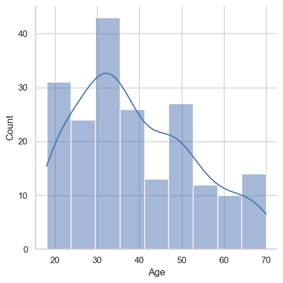

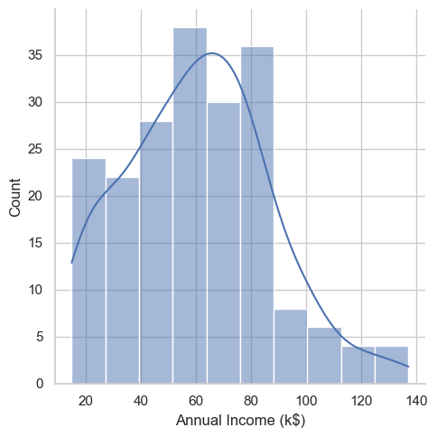

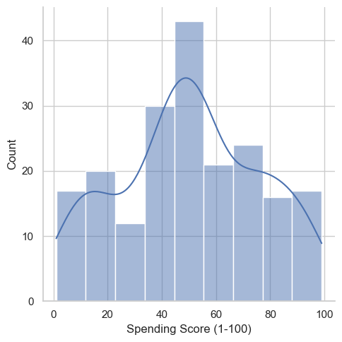

<br>*Notebook reference: generated from the `sns.displot(df[i], kde=True)` loop in the
Univariate EDA section.*

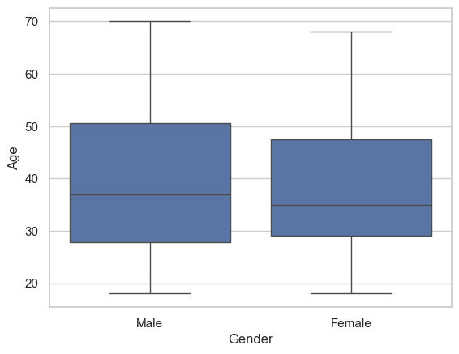

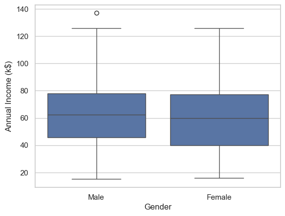

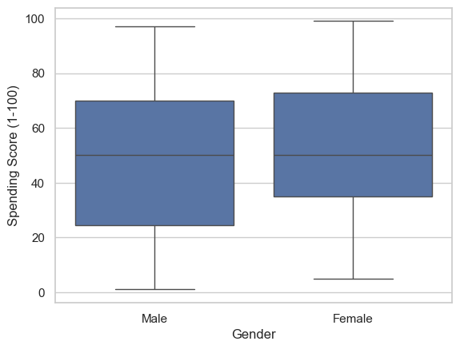

<br>*Notebook reference: generated from the `sns.boxplot(data=df, x='Gender', y=df[i])` loop.*

### Step 2: Demographic Density Analysis

These density plots compare Age, Annual Income, and Spending Score distributions by Gender.
They are descriptive comparisons within the 200-customer sample and do not establish a causal
effect or a targeting conclusion.

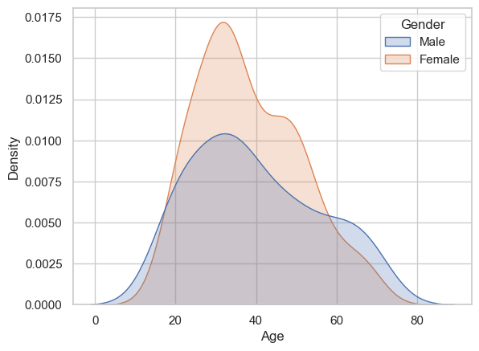

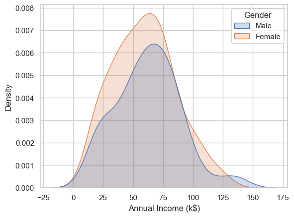

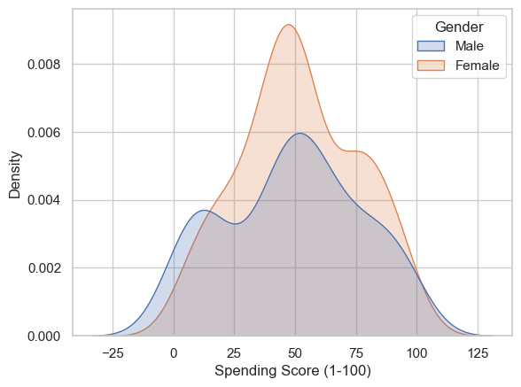

<br>*Notebook reference: generated from the `sns.kdeplot(data=df, x=i, hue='Gender',
fill=True, shade=True)` loop.*

### Step 3: Correlation & Bivariate Mapping

The heatmap and pairplot summarize observed pairwise relationships. The Annual Income and
Spending Score scatter plot shows visible sample-level groupings that motivate examining more
than one variable together.

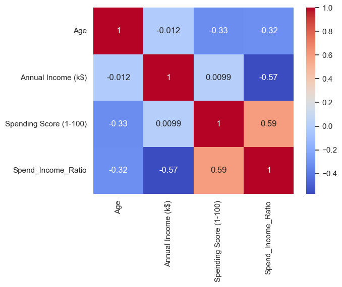

<br>*Notebook reference: generated from the `sns.heatmap` cell.*

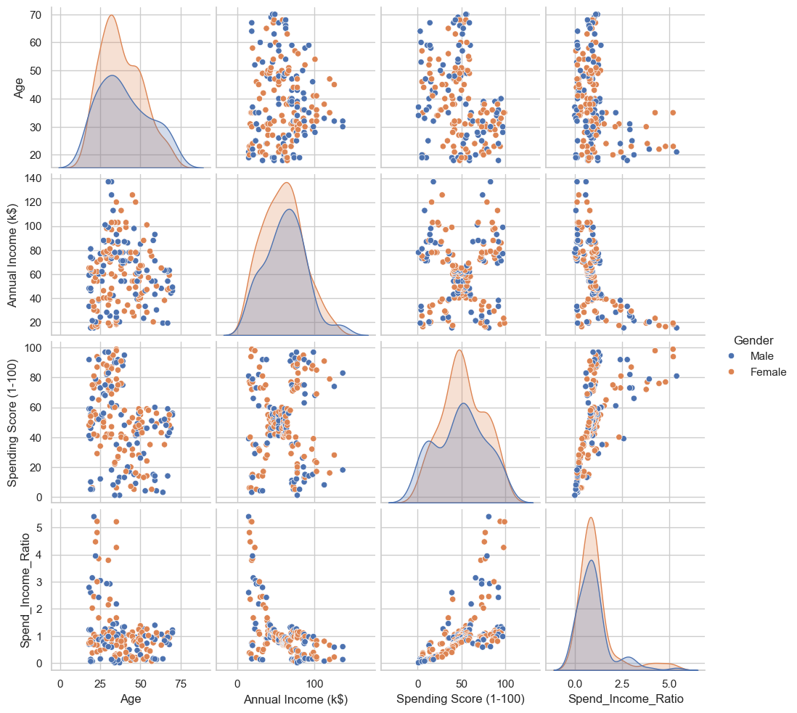

<br>*Notebook reference: generated from the `sns.pairplot(df_pair, hue='Gender')` cell.*

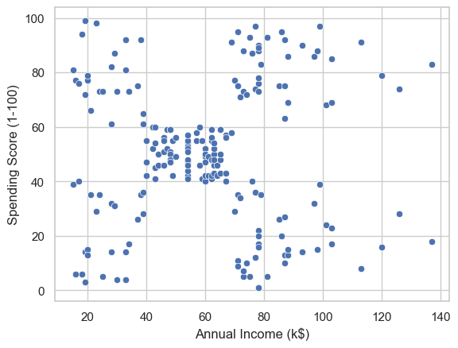

<br>*Notebook reference: generated from the `sns.scatterplot` cell for Annual Income and
Spending Score.*

### Step 4: Elbow Method Across Model Stages

These plots track within-cluster variation as the workflow moves from income-only clustering
to Annual Income + Spending Score and then to the multivariate model.

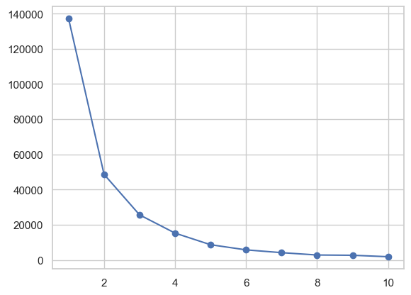

<br>*Notebook reference: generated from the univariate income elbow loop.*

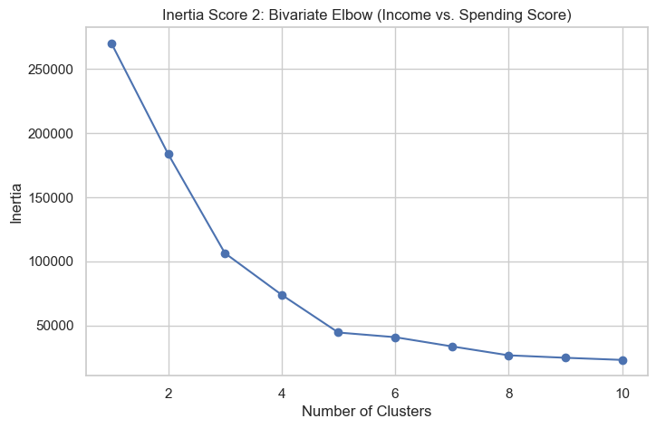

<br>*Notebook reference: generated from the bivariate income and Spending Score elbow loop.*

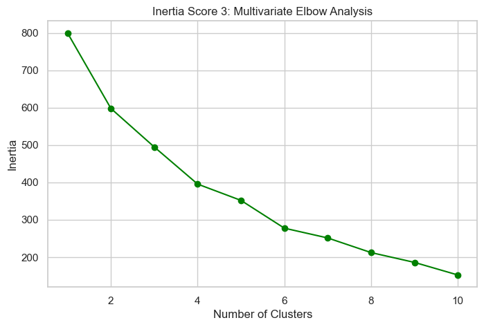

<br>*Notebook reference: generated from the multivariate elbow loop `kmeans3.fit(dff_scaled)`.*

The multivariate elbow curve supported K = 5 as the working model choice for this sample. The
elbow method does not prove that five permanent customer types exist, and no other cluster
quality measure was used for final selection.

### Step 5: Income + Spending Score Baseline Map

This plot shows the earlier bivariate clustering step using Annual Income and Spending Score.
It is useful for visualizing the two-dimensional baseline, but it is not the final
four-variable segmentation.

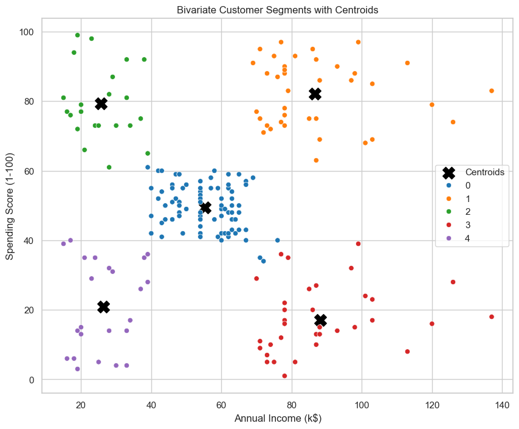

<br>*Notebook reference: generated from the `sns.scatterplot` cell extracting
`clustering2.cluster_centers_`.*

## Interpretation Limits and Next Tests

- The analysis describes a 200-customer sample.
- Spending Score is a 1-100 index, not dollars spent.
- K = 5 is a practical model choice supported by the multivariate elbow analysis, not a
  claim about five permanent customer types.
- The clusters are hypotheses for testing, not finished marketing personas.
- The source data has no revenue, profit, customer lifetime value, campaign response,
  purchase frequency, basket value, product preference, or reason for Spending Score.
- The current data does not explain why the higher-income clusters have different Spending
  Scores.
- Future analysis should add behavioral variables, use a larger customer population, apply
  more than one cluster-quality measure, test cluster stability, and measure customer
  responses to defined treatments.

## Tools & Environment

- **Python:** Primary language for the analysis pipeline.
- **Pandas & NumPy:** Data cleaning, aggregation, and matrix manipulation.
- **Scikit-learn:** Preprocessing with `StandardScaler` and clustering with `KMeans`.
- **Seaborn & Matplotlib:** Multivariate visualization and density plotting.
- **Jupyter Notebook:** Reproducible analytical workflow in
  `customer_segmentation_analysis.ipynb`.
- **VS Code:** Integrated development environment.

## Project Links

- [Strategic Segmentation Report](Delivarables/Strategic_Segmentation_Report.md)
- [Final Labeled Dataset (CSV)](Delivarables/Strategic_Customer_Segmentation_Final.csv)

The notebook, source CSV, visualization assets, final labeled CSV, and source-text report are
included so the workflow and its interpretation boundaries can be reviewed together.
